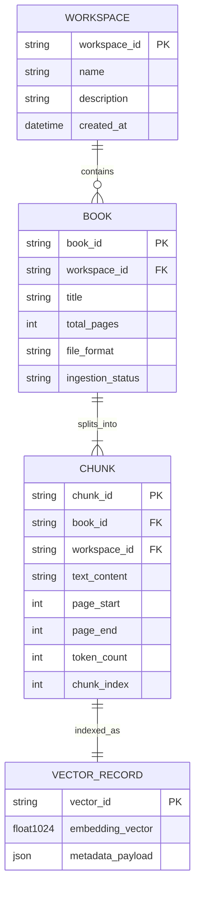
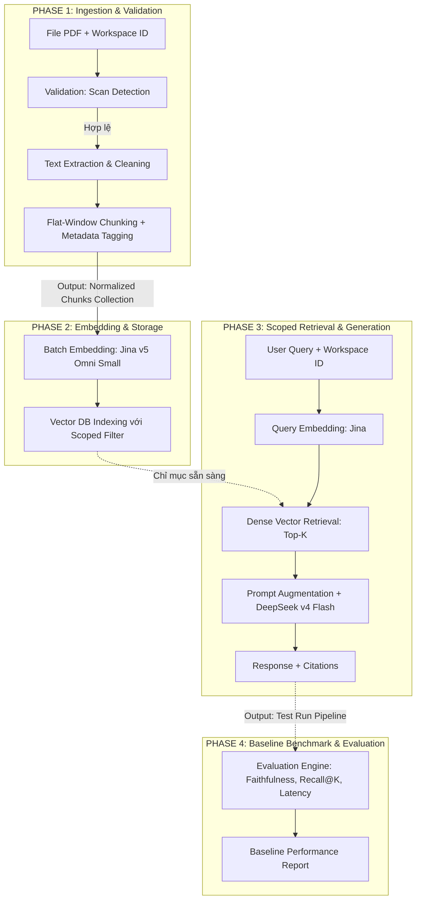

# High-Level Design & Functional Specification: E-Book RAG Engine (Baseline MVP)

## 1. Tổng quan Dự án (Executive Summary)
Dự án **E-Book RAG Engine** là hệ thống hỏi đáp và truy xuất thông tin thông minh trên tập tài liệu sách điện tử (E-books). Hệ thống cho phép người dùng tổ chức sách theo từng Không gian làm việc (Workspace / Project), thực hiện các truy vấn ngữ nghĩa trong phạm vi cô lập và nhận câu trả lời chính xác có đính kèm số trang trích dẫn.

Tài liệu này đóng vai trò là **High-Level Design (HLD) & Functional Specification**, duy trì góc nhìn **Hộp đen (Black-box)** và **Độc lập ngôn ngữ (Code-agnostic)**, tập trung vào luồng dữ liệu, hợp đồng giao diện, cấu hình tham số và tiêu chí thành công theo từng Phase. Toàn bộ môi trường phát triển và thực thi dự án được chuẩn hóa quản lý bởi công cụ **`uv`**.

---

## 2. Phạm vi & Ràng buộc Hệ thống (Scope & Constraints)

* **Môi trường & Công cụ Thực thi**: Toàn bộ dự án được quản lý qua công cụ **`uv`** (Python package & environment manager).
* **Định danh Package & Repository (`exocort`)**: Tên repository và Python package chính thức của dự án là **`exocort`** (viết tắt/bắt nguồn từ khái niệm *Exocortex* – vỏ não ngoài / hệ thống lưu trữ và khuếch đại nhận thức nhân tạo hỗ trợ con người tra cứu tri thức chuyên sâu). Toàn bộ mã nguồn được đặt trong thư mục gốc `src/exocort/` và import nhất quán dạng `from exocort...` qua tất cả các Phase.
* **Định dạng tài liệu hỗ trợ (MVP)**:
  - Chỉ hỗ trợ định dạng **Digital PDF** (có lớp văn bản - text layer hợp lệ).
  - Ngôn ngữ tài liệu: **Tiếng Anh (English)**.
  - Xử lý PDF dạng Scan: Hệ thống **từ chối tiếp nhận** và hiển thị thông báo không hỗ trợ rõ ràng trong giai đoạn MVP.
* **Mô hình Trích dẫn (Citation Model)**: Mức tài liệu gồm **Tên sách (Book Title)** + **Số trang (Page Number)**.
* **Mô hình Không gian làm việc (Workspace Scoping)**: Người dùng có thể tạo các Workspace độc lập, phân loại sách vào từng Workspace; mọi truy vấn đều được giới hạn trong phạm vi Workspace đã chọn.
* **Nhà cung cấp & Mô hình AI**:
  - **Mô hình Sinh ngôn ngữ (LLM)**: `deepseek/deepseek-v4-flash-0731` thông qua nhà cung cấp **OpenRouter**.
  - **Mô hình Nhúng Vector (Embedding)**: `jina-embeddings-v5-omni-small` thông qua nhà cung cấp **Jina AI**.

---

## 3. Kiến trúc Tổng thể & Mô hình Thực thể (System Architecture & Entity Model)

### 3.1. Sơ đồ Kiến trúc Hộp đen (Black-box Architecture)

```
                       +---------------------------------------+
                       |           NGƯỜI DÙNG / CLIENT         |
                       +---------------------------------------+
                                   |                 |
                    (Quản lý Sách & Workspace)    (Truy vấn theo ngữ cảnh)
                                   v                 v
+----------------------------------------------------------------------------------+
|                          E-BOOK RAG ENGINE (Managed by uv)                       |
|                                                                                  |
|  [Module 1: Workspace Manager]      -->  [Module 2: Ingestion & Validation]      |
|                                                              |                   |
|                                                              v                   |
|  [Module 4: Generation & Citation]  <--  [Module 3: Embedding & Scoped Retrieval] |
+----------------------------------------------------------------------------------+
           |                                                 |
           v                                                 v
   [OpenRouter / DeepSeek API]                      [Jina AI Embedding API]
```

### 3.2. Mô hình Thực thể Dữ liệu (Entity Domain Model)



### 3.3. Chiến lược Lưu trữ & Ranh giới Persistence (Persistence & Storage Strategy)

* **Tầng Vector Storage (Scoped Vector Store)**:
  - Sử dụng **ChromaDB persistent** (`./chroma_data`) để lưu trữ các bản ghi `VECTOR_RECORD` và metadata chunk (`workspace_id`, `book_id`, `page_start`, `page_end`, `text_content`).
  - Dữ liệu vector được lưu bền vững trên ổ đĩa và tồn tại qua các lần restart hệ thống.

* **Tầng Quản trị Metadata (Workspace & Book Metadata)**:
  - **Baseline MVP**: Được quản lý **In-Memory** (`WorkspaceManager` lưu trữ qua cấu trúc `dict` trong RAM) để tối giản phạm vi và độ phức tạp khởi đầu.
  - **Lưu ý Kiến trúc & Rủi ro Dữ liệu Mồ côi (Architectural Note & Orphan Data Risk)**: Do metadata quản lý không được lưu xuống đĩa trong giai đoạn MVP, khi service/process khởi động lại, danh sách Workspace/Book trong RAM sẽ bị xóa sạch trong khi các bản ghi vector tương ứng vẫn tồn tại trong ChromaDB. Điều này dẫn đến tình trạng các vector record cũ bị "mồ côi" (orphan records) nếu người dùng truy vấn theo `workspace_id` đã bị mất ở tầng quản trị.
  - **Hướng xử lý & Lộ trình (Roadmap Evolution)**: Ở Vòng lặp tiếp theo, hệ thống sẽ bổ sung cơ chế Persistence cho metadata quản lý (ví dụ: SQLite hoặc RDBMS) để đảm bảo tính đồng bộ bền vững hoàn toàn giữa tầng Quan hệ và tầng Vector Store.

---

## 4. Đặc tả Pipeline theo từng Phase (Chained Phase Specifications)

Hệ thống được chia thành 4 Phase phát triển tuần tự. Đầu ra của Phase trước là điều kiện tiên quyết và đầu vào của Phase sau.



---

### 4.1. PHASE 1: Tiếp nhận, Kiểm định & Phân mảnh Dữ liệu (Ingestion & Validation)

* **Mục tiêu**: Xử lý và chuyển đổi file PDF thành các khối văn bản chuẩn hóa, loại trừ PDF scan không hợp lệ.
* **Đầu vào (Input)**:
  - File tài liệu PDF (dạng nhị phân / luồng dữ liệu).
  - `workspace_id`: Mã định danh không gian làm việc.
  - `book_title`: Tên sách.
* **Xử lý Chức năng (Functional Processing)**:
  1. *Validation Gate*: Đo mật độ ký tự văn bản có nghĩa trên mỗi trang. Nếu tỷ lệ trang hợp lệ (≥ 50 ký tự/trang) thấp hơn 50% tổng số trang, lập tức từ chối và trả về mã lỗi `ERR_UNSUPPORTED_SCANNED_PDF`.
  2. *Text Extraction*: Trích xuất toàn bộ văn bản theo từng trang, lưu giữ ranh giới trang (character offset).
  3. *Cross-page Flat-Window Chunking*: Nối toàn bộ văn bản các trang thành chuỗi liên tục, phân đoạn bằng cửa sổ trượt token-based (`tiktoken`, encoding `cl100k_base`), ánh xạ ngược vị trí trang qua character offset:
     - Kích thước khối (Chunk Size): `512 tokens`.
     - Độ gối đầu (Chunk Overlap): `50 tokens` (~10%).
  4. *Metadata Binding*: Đóng gói mỗi chunk thành một thực thể có cấu trúc kèm thông tin định danh, gồm `page_start` và `page_end` (hỗ trợ chunk liên trang).
* **Đầu ra (Output)**: **Normalized Chunks Collection** (Tập hợp các chunk chuẩn hóa kèm metadata).
* **Tiêu chí Hoàn thành (DoD)**:
  - 100% file PDF scan bị từ chối với thông báo chuẩn.
  - 100% chunk được gán đúng `workspace_id`, `book_title`, `page_start`, `page_end`.

---

### 4.2. PHASE 2: Số hóa Vector & Lưu trữ Chỉ mục (Embedding & Vector Storage)

* **Mục tiêu**: Chuyển đổi các khối văn bản thành vector không gian ngữ nghĩa và lưu trữ có phân vùng theo Workspace.
* **Đầu vào (Input)**:
  - Normalized Chunks Collection từ **Phase 1**.
* **Xử lý Chức năng (Functional Processing)**:
  1. *Batch Grouping*: Gom nhóm các chunk thành từng lô (Batch Size = 32 chunks).
  2. *Vector Embedding*: Gửi văn bản tới mô hình `jina-embeddings-v5-omni-small` để tạo vector đặc trưng (Dense Vectors).
  3. *Scoped Vector Indexing*: Ghi dữ liệu vào Vector Database. Cấu hình bảng chỉ mục cho phép lọc dữ liệu (Filtered Search) dựa trên trường `workspace_id`.
* **Đầu ra (Output)**: **Scoped Vector Index** (Chỉ mục Vector sẵn sàng nhận các truy vấn tìm kiếm).
* **Tiêu chí Hoàn thành (DoD)**:
  - Tỷ lệ hoàn thành nhúng vector đạt 100% trên các chunk hợp lệ.
  - Tốc độ lập chỉ mục đạt tối thiểu $\ge$ 50 trang PDF/phút.

---

### 4.3. PHASE 3: Truy xuất có Phạm vi & Sinh phản hồi (Scoped Retrieval & Generation)

* **Mục tiêu**: Tìm kiếm các đoạn trích liên quan nhất trong Workspace chỉ định và sinh câu trả lời có trích dẫn nguồn.
* **Đầu vào (Input)**:
  - Câu hỏi của người dùng (`query_text`).
  - `workspace_id`: Mã không gian làm việc cần tra cứu.
  - Scoped Vector Index từ **Phase 2**.
* **Xử lý Chức năng (Functional Processing)**:
  1. *Query Embedding*: Vector hóa câu hỏi bằng `jina-embeddings-v5-omni-small`.
  2. *Scoped Dense Retrieval*: Truy vấn Top-K ($K=5$) chunk có độ tương đồng Cosine cao nhất, áp dụng bộ lọc cứng `workspace_id = <target_workspace>`.
  3. *Context Augmentation*: Đóng gói Top-K chunks thành khối ngữ cảnh (Context Block) kèm định danh Tên sách và Số trang.
  4. *Inference*: Gửi Prompt và Ngữ cảnh tới mô hình `deepseek/deepseek-v4-flash-0731` qua OpenRouter với chỉ thị sinh câu trả lời khách quan, không bịa đặt và dẫn nguồn chuẩn xác.
* **Đầu ra (Output)**: **Grounded Answer & Citation List** (Nội dung trả lời và danh sách `[Tên sách - Số trang]`).
* **Tiêu chí Hoàn thành (DoD)**:
  - 100% câu trả lời chỉ sử dụng dữ liệu trong Workspace được chỉ định (cô lập hoàn toàn).
  - Độ trễ phản hồi (End-to-End Latency) $\le$ 2.5 giây/câu hỏi.

---

### 4.4. PHASE 4: Đánh giá & Thiết lập Điểm chuẩn Baseline (Evaluation & Benchmarking)

* **Mục tiêu**: Đo lường và định lượng chất lượng của hệ thống Baseline để làm căn cứ cho các cải tiến tiếp theo.
* **Đầu vào (Input)**:
  - Tập dữ liệu kiểm thử chuẩn (Golden Evaluation Set gồm tối thiểu 30 câu hỏi Q&A có đáp án và vị trí trang mẫu).
  - Pipeline hoàn chỉnh từ **Phase 1 $\rightarrow$ Phase 3**.
* **Xử lý Chức năng (Functional Processing)**:
  1. Tự động thực thi toàn bộ tập câu hỏi kiểm thử trên hệ thống bằng lệnh `uv run`.
  2. Thu thập và tính toán các chỉ số:
     - **Retrieval Recall@5**: Tỷ lệ câu hỏi mà trang chứa thông tin cần tìm xuất hiện trong Top-5 chunk truy xuất.
     - **Answer Faithfulness**: Tỷ lệ thông tin trong câu trả lời có bằng chứng trực tiếp từ ngữ cảnh trích xuất.
     - **Latency & Token Consumption**: Thời gian trung bình và số lượng token tiêu thụ mỗi lượt truy vấn.
* **Đầu ra (Output)**: **Baseline Performance Report** (Báo cáo đo lường chất lượng hệ thống).
* **Tiêu chí Hoàn thành (DoD)**:
  - **Retrieval Recall@5** $\ge$ 70%.
  - **Faithfulness Score** $\ge$ 85%.
  - Xuất bản tài liệu Báo cáo Baseline hoàn chỉnh.

---

## 5. Bảng Cấu hình Tham số (Black-box Configuration Parameters)

| Mô-đun | Tham số | Giá trị Cấu hình | Mục đích |
| :--- | :--- | :--- | :--- |
| **Ingestion** | `chunk_size` | `512 tokens` | Kích thước phân đoạn văn bản cố định |
| **Ingestion** | `chunk_overlap` | `50 tokens` | Độ gối đầu giữ liền mạch ngữ nghĩa giữa các chunk |
| **Ingestion** | `tokenizer` | `cl100k_base (tiktoken)` | Bộ mã hóa token cho phân đoạn chính xác |
| **Validation** | `min_text_density` | `50 chars/page` | Ngưỡng phát hiện và từ chối file PDF Scan |
| **Validation** | `min_valid_page_ratio` | `0.5 (50%)` | Tỷ lệ trang hợp lệ tối thiểu để chấp nhận PDF |
| **Embedding** | `model_name` | `jina-embeddings-v5-omni-small` | Mô hình trích xuất vector đặc trưng |
| **Embedding** | `embedding_dimension` | `1024` | Số chiều vector đặc trưng do mô hình Jina sinh ra |
| **Embedding** | `batch_size` | `32` | Số lượng chunk trong một lượt gọi API |
| **Vector DB** | `distance_metric` | `Cosine` | Thang đo độ tương đồng góc giữa các vector |
| **Vector DB** | `persist_dir` | `./chroma_data` | Thư mục lưu trữ ChromaDB persistent |
| **Retrieval** | `top_k` | `5` | Số lượng đoạn trích liên quan nhất đưa vào Context |
| **Generation** | `model_name` | `deepseek/deepseek-v4-flash-0731` | Mô hình sinh ngôn ngữ tự nhiên qua OpenRouter |
| **Generation** | `temperature` | `0.1` | Thiết lập tính xác thực cao, hạn chế sáng tạo |
| **Generation** | `max_tokens` | `1024` | Độ dài phản hồi tối đa của câu trả lời |

---

## 6. Đặc tả Giao diện Chức năng (Functional API Contracts)

### 6.1. Quản lý Không gian làm việc (Workspace Management)
```
CreateWorkspace(name: string, description: string) 
  -> { workspace_id: string, name: string, created_at: timestamp }

ListWorkspaces() 
  -> [ { workspace_id: string, name: string, book_count: integer } ]

AssignBookToWorkspace(workspace_id: string, book_id: string) 
  -> { status: "SUCCESS" | "FAILED", message: string }
```

### 6.2. Nạp và Xử lý Sách (Ingestion API)
```
IngestBook(file_payload: binary, workspace_id: string, book_title: string) 
  -> IngestionResult
```

* **Kết quả Thành công**:
```json
{
  "status": "COMPLETED",
  "book_id": "bk_98a72b10",
  "book_title": "Design Patterns: Elements of Reusable Object-Oriented Software",
  "total_pages": 395,
  "total_chunks_indexed": 1120,
  "processing_time_sec": 12.8
}
```

* **Kết quả Từ chối PDF Scan**:
```json
{
  "status": "REJECTED",
  "error_code": "ERR_UNSUPPORTED_SCANNED_PDF",
  "message": "Scanned PDF format without valid text layer is not supported in MVP baseline."
}
```

### 6.3. Truy vấn Tri thức theo Không gian (Scoped Query API)
```
QueryWorkspace(workspace_id: string, query_text: string, top_k: integer = 5) 
  -> QueryResult
```

* **Kết quả Trả về**:
```json
{
  "query": "What are the key differences between Factory Method and Abstract Factory?",
  "workspace_id": "ws_software_eng_01",
  "answer": "Factory Method uses inheritance and relies on a subclass to handle the desired object instantiation, whereas Abstract Factory is an object-based pattern where a separate factory object is delegated the responsibility of creating families of related or dependent objects without specifying their concrete classes.",
  "citations": [
    {
      "book_title": "Design Patterns: Elements of Reusable Object-Oriented Software",
      "page_start": 87,
      "page_end": 88,
      "relevance_score": 0.91,
      "text_content": "The Factory Method pattern defines an interface for creating an object, but lets subclasses decide which class to instantiate..."
    },
    {
      "book_title": "Design Patterns: Elements of Reusable Object-Oriented Software",
      "page_start": 107,
      "page_end": 107,
      "relevance_score": 0.88,
      "text_content": "Abstract Factory provides an interface for creating families of related or dependent objects without specifying their concrete classes..."
    }
  ],
  "metrics": {
    "retrieval_time_ms": 115,
    "generation_time_ms": 580,
    "total_latency_ms": 695
  }
}
```

---

## 7. Lộ trình Nâng cấp Hệ thống (Evolutionary Roadmap)

1. **Vòng lặp 1 (Hiện tại - Baseline MVP)**:
   - Quản lý môi trường nhanh gọn với `uv`.
   - Cửa sổ trượt cố định (Flat-Window Chunking).
   - Truy xuất Vector đơn thuần (Jina Dense Retrieval) + Phân vùng Workspace.
   - Sinh phản hồi với DeepSeek v4 Flash.
2. **Vòng lặp 2 (Nâng cấp Cấu trúc & Ngữ nghĩa - Semantic Chunking & Metadata Persistence)**:
   - Lưu trữ bền vững Metadata Workspace/Book qua SQLite/RDBMS để loại trừ rủi ro dữ liệu mồ côi khi restart service.
   - Trích xuất Mục lục (TOC Extraction) & Phân tích cấu trúc phân cấp Chương/Mục.
   - Phân mảnh theo ranh giới ngữ nghĩa của sách.
3. **Vòng lặp 3 (Nâng cấp Tìm kiếm Lai & Tái xếp hạng - Hybrid Search & Reranking)**:
   - Bổ sung chỉ mục từ khóa (BM25 Sparse Index) song song với Jina Dense Vector.
   - Tích hợp mô hình Reranker để nâng cao Recall@5 lên $\ge 85\%$.
4. **Vòng lặp 4 (Truy vấn Tổng hợp Toàn cục - Global Synthesis)**:
   - Hỗ trợ câu hỏi tổng quát toàn bộ cuốn sách hoặc so sánh chéo nhiều sách trong Workspace (Hierarchical Summarization / Map-Reduce RAG).
