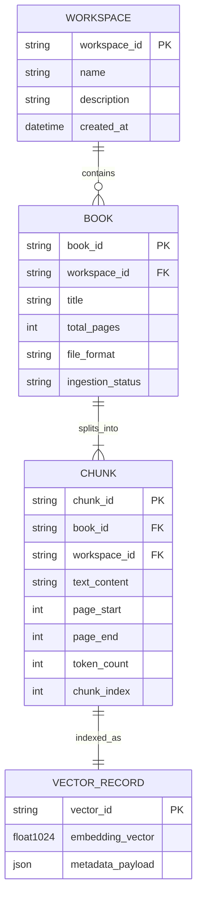
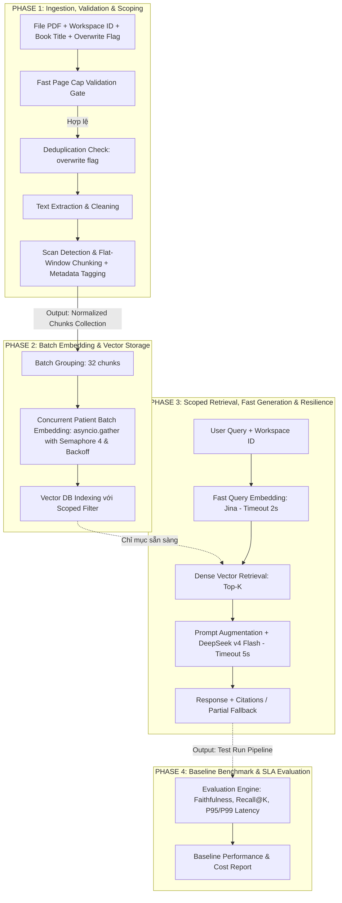

# High-Level Design & Functional Specification: E-Book RAG Engine (Baseline MVP)

## 1. Tổng quan Dự án (Executive Summary)
Dự án **E-Book RAG Engine** là hệ thống hỏi đáp và truy xuất thông tin thông minh trên tập tài liệu sách điện tử (E-books). Hệ thống cho phép người dùng tổ chức sách theo từng Không gian làm việc (Workspace / Project), thực hiện các truy vấn ngữ nghĩa trong phạm vi cô lập và nhận câu trả lời chính xác có đính kèm số trang trích dẫn.

Tài liệu này đóng vai trò là **High-Level Design (HLD) & Functional Specification**, duy trì góc nhìn **Hộp đen (Black-box)** và **Độc lập ngôn ngữ (Code-agnostic)**, tập trung vào luồng dữ liệu, hợp đồng giao diện, cấu hình tham số, chính sách phục hồi lỗi (Resilience), quản trị chi phí và tiêu chí thành công theo từng Phase. Toàn bộ môi trường phát triển và thực thi dự án được chuẩn hóa quản lý bởi công cụ **`uv`**.

---

## 2. Phạm vi & Ràng buộc Hệ thống (Scope & Constraints)

* **Môi trường & Công cụ Thực thi**: Toàn bộ dự án được quản lý qua công cụ **`uv`** (Python package & environment manager).
* **Định danh Package & Repository (`exocort`)**: Tên repository và Python package chính thức của dự án là **`exocort`** (viết tắt/bắt nguồn từ khái niệm *Exocortex* – vỏ não ngoài / hệ thống lưu trữ và khuếch đại nhận thức nhân tạo hỗ trợ con người tra cứu tri thức chuyên sâu). Toàn bộ mã nguồn được đặt trong thư mục gốc `src/exocort/` và import nhất quán dạng `from exocort...` qua tất cả các Phase.
* **Định dạng tài liệu hỗ trợ (MVP)**:
  - Chỉ hỗ trợ định dạng **Digital PDF** (có lớp văn bản - text layer hợp lệ).
  - Ngôn ngữ tài liệu: **Tiếng Anh (English)**.
  - Xử lý PDF dạng Scan: Hệ thống **từ chối tiếp nhận** và hiển thị thông báo không hỗ trợ rõ ràng trong giai đoạn MVP (`ERR_UNSUPPORTED_SCANNED_PDF`).
* **Mô hình Trích dẫn (Citation Model)**: Mức tài liệu gồm **Tên sách (Book Title)** + **Số trang (Page Number / Page Range)**.
* **Mô hình Không gian làm việc & Định danh Sách (Workspace Scoping & Book Uniqueness)**:
  - Người dùng có thể tạo các Workspace độc lập, phân loại sách vào từng Workspace; mọi truy vấn đều được giới hạn trong phạm vi Workspace đã chọn.
  - Tên sách (`book_title`) là duy nhất trong phạm vi từng Workspace. Hai Workspace khác nhau có thể chứa sách cùng tên.
  - Nạp lại sách trùng tên trong cùng Workspace phải tuân thủ chính sách **Deduplication & Re-ingestion Policy** (chặn trùng mặc định khi `overwrite=false`; khi `overwrite=true`, áp dụng mô hình **Atomic Replacement theo cơ chế Blue-Green Stage & Swap**: hoàn tất nhúng và lập chỉ mục bản mới trước, chỉ hoán đổi metadata và dọn dẹp bản cũ sau khi bản mới sẵn sàng 100%, bảo vệ dữ liệu cũ nguyên vẹn nếu xảy ra lỗi giữa chừng).
  - **Kiểm soát đồng thời (Concurrency Control)**: Sử dụng khóa `asyncio.Lock` phân định theo cặp `(workspace_id, book_title)` để bảo vệ toàn bộ chu trình nạp (Check $\rightarrow$ Embed $\rightarrow$ Assign), triệt tiêu hoàn toàn Race Condition khi có các request nạp sách trùng tên gửi tới đồng thời.
* **Nhà cung cấp & Mô hình AI**:
  - **Mô hình Sinh ngôn ngữ (LLM)**: `deepseek/deepseek-v4-flash-0731` thông qua nhà cung cấp **OpenRouter**.
  - **Mô hình Nhúng Vector (Embedding)**: `jina-embeddings-v5-omni-small` thông qua nhà cung cấp **Jina AI**.
* **Quản trị Bảo mật & Khóa Bí mật (Secrets & Credential Management)**:
  - Các API key (`JINA_API_KEY`, `OPENROUTER_API_KEY`) được nạp tự động qua biến môi trường hoặc tệp `.env` sử dụng kiểu dữ liệu `SecretStr` để chống rò rỉ vào log, print hoặc payload exception.
  - Hệ thống áp dụng cơ chế **Fail-fast Validation** khi khởi tạo nếu thiếu API key (`ERR_MISSING_API_KEY`).
* **Hạn mức Tài nguyên & Kiểm soát Chi phí (Cost Guardrails)**:
  - Giới hạn độ dài tài liệu tối đa: `max_pages_per_book = 1000 trang`, `max_chunks_per_book = 3000 chunks` nhằm ngăn ngừa cạn kiệt ngân sách token.

---

## 3. Kiến trúc Tổng thể & Mô hình Thực thể (System Architecture & Entity Model)

#### 3.1. Sơ đồ Kiến trúc Hộp đen (Black-box Architecture)

```
                       +---------------------------------------+
                       |           NGƯỜI DÙNG / CLIENT         |
                       +---------------------------------------+
                                    |                 |
                     (Quản lý Sách & Workspace)    (Truy vấn theo ngữ cảnh)
                                    v                 v
+----------------------------------------------------------------------------------+
|                          E-BOOK RAG ENGINE (Managed by uv)                       |
|                                                                                  |
|  [Module 1: Workspace Manager]      -->  [Module 2: Ingestion & Validation]      |
|                                                              |                   |
|                                                              v                   |
|  [Module 4: Generation & Citation]  <--  [Module 3: Embedding & Scoped Retrieval] |
+----------------------------------------------------------------------------------+
           |                                                 |
           v                                                 v
    [OpenRouter / DeepSeek API]                      [Jina AI Embedding API]
    (Timeout: 5.0s, Fast Retry: 2x)                  (Ingest: 45s, Query: 2.0s)
```

### 3.2. Mô hình Thực thể Dữ liệu (Entity Domain Model)



### 3.3. Chiến lược Lưu trữ & Ranh giới Persistence (Persistence & Storage Strategy)

* **Tầng Vector Storage (Scoped Vector Store)**:
  - Sử dụng **ChromaDB persistent** (`./chroma_data`) để lưu trữ các bản ghi `VECTOR_RECORD` và metadata chunk (`workspace_id`, `book_id`, `book_title`, `page_start`, `page_end`, `text_content`, `chunk_index`).
  - Dữ liệu vector được lưu bền vững trên ổ đĩa và tồn tại qua các lần restart hệ thống.
  - Cung cấp cơ chế xóa sạch triệt để theo sách `delete_by_book(book_id)` để phục vụ dọn dẹp vector cũ sau khi hoàn tất Atomic Replacement (Stage & Swap) khi ghi đè sách.

* **Tầng Quản trị Metadata (Workspace & Book Metadata)**:
  - **Baseline MVP**: Được quản lý và lưu trữ bền vững qua **SQLite Persistent Storage** (`WorkspaceManager` lưu trữ danh mục `Workspace` và `BookMetadata` tại `./chroma_data/metadata.db`, có hỗ trợ `:memory:` cho kiểm thử độc lập).
  - **Đồng bộ Vòng đời & Triệt tiêu Dữ liệu Mồ côi**: Đồng bộ 100% vòng đời dữ liệu giữa tầng Quản trị Metadata và ChromaDB. Sau khi restart service hoặc process, toàn bộ thông tin Workspace và BookMetadata được nạp lại tức thì, đảm bảo các API `query_workspace` không bị trả lỗi `ERR_WORKSPACE_NOT_FOUND` và loại bỏ hoàn toàn rủi ro dữ liệu vector bị cô lập/mồ côi.
  - **Lộ trình Mở rộng (Roadmap Evolution)**: Khi hệ thống mở rộng đa người dùng / microservices quy mô lớn ở các vòng lặp sau, tầng SQLite có thể chuyển đổi trong suốt sang PostgreSQL/RDBMS mà không làm thay đổi hợp đồng giao diện của `WorkspaceManager`.

---

## 4. Đặc tả Pipeline theo từng Phase (Chained Phase Specifications)

Hệ thống được chia thành 4 Phase phát triển tuần tự. Đầu ra của Phase trước là điều kiện tiên quyết và đầu vào của Phase sau.



---

### 4.1. PHASE 1: Tiếp nhận, Kiểm định & Phân mảnh Dữ liệu (Ingestion & Validation)

* **Mục tiêu**: Kiểm tra tính hợp lệ về độ dài, định dạng, trùng lặp và chuyển đổi file PDF thành các khối văn bản chuẩn hóa, loại trừ PDF scan hoặc tài liệu vượt hạn mức.
* **Đầu vào (Input)**:
  - File tài liệu PDF (dạng nhị phân / luồng dữ liệu `bytes`).
  - `workspace_id`: Mã định danh không gian làm việc.
  - `book_title`: Tên sách.
  - `overwrite`: Cờ cho phép ghi đè sách trùng tên (`bool`, mặc định `false`).
* **Xử lý Chức năng (Functional Processing)**:
  1. *Workspace Existence Check*: Kiểm tra `workspace_id` có tồn tại không. Nếu không, từ chối với mã lỗi `ERR_WORKSPACE_NOT_FOUND`.
  2. *Deduplication Gate*: Kiểm tra xem sách cùng `book_title` đã tồn tại trong Workspace chưa.
     - Nếu đã tồn tại và `overwrite == false`: Lập tức từ chối với mã lỗi `ERR_DUPLICATE_BOOK_TITLE`.
     - Nếu đã tồn tại và `overwrite == true`: Cho phép tiếp tục luồng nạp theo quy trình Staged Atomic Replacement (tạo `new_book_id` riêng biệt, nhúng và lập chỉ mục bản mới trước, chỉ dọn dẹp `old_book_id` sau khi bản mới thành công 100%).
  3. *Page Cap Validation Gate (Fail-Fast)*: Đếm nhanh số trang PDF qua cấu trúc tài liệu (`len(reader.pages)`) trước khi giải mã nội dung. Nếu vượt quá `max_pages_per_book` (1,000 trang), lập tức từ chối với mã lỗi `ERR_DOCUMENT_TOO_LARGE` mà không trích xuất text, tiết kiệm tối đa CPU/RAM và chi phí.
  4. *Text Extraction*: Trích xuất toàn bộ văn bản theo từng trang cho tài liệu hợp lệ trong hạn mức, lưu giữ ranh giới trang (character offset).
  5. *Scan Detection Gate*: Đo mật độ ký tự văn bản có nghĩa trên mỗi trang. Nếu tỷ lệ trang hợp lệ (≥ 50 ký tự/trang) thấp hơn 50% tổng số trang, lập tức từ chối với mã lỗi `ERR_UNSUPPORTED_SCANNED_PDF`.
  6. *Cross-page Flat-Window Chunking*: Nối toàn bộ văn bản các trang thành chuỗi liên tục, phân đoạn bằng cửa sổ trượt token-based (`tiktoken`, encoding `cl100k_base`), ánh xạ ngược vị trí trang qua character offset:
     - Kích thước khối (Chunk Size): `512 tokens`.
     - Độ gối đầu (Chunk Overlap): `50 tokens` (~10%).
     - Nếu tổng số chunk > `max_chunks_per_book` (3,000 chunks), từ chối với mã lỗi `ERR_DOCUMENT_TOO_LARGE`.
  7. *Metadata Binding*: Đóng gói mỗi chunk thành một thực thể có cấu trúc kèm thông tin định danh (`book_title`, `workspace_id`, `page_start`, `page_end`, `chunk_index`).
* **Đầu ra (Output)**: **Normalized Chunks Collection** (Tập hợp các chunk chuẩn hóa kèm metadata).
* **Tiêu chí Hoàn thành (DoD)**:
  - 100% file vượt quá 1,000 trang bị từ chối ngay lập tức với mã lỗi `ERR_DOCUMENT_TOO_LARGE` trước khi extract text.
  - 100% file PDF scan bị từ chối với mã lỗi `ERR_UNSUPPORTED_SCANNED_PDF`.
  - Sách trùng tên bị chặn khi `overwrite=false` và được xử lý thay thế sạch sẽ khi `overwrite=true` không gây mất dữ liệu nếu nạp thất bại.
  - 100% chunk được gán đúng `workspace_id`, `book_title`, `page_start`, `page_end`.

---

### 4.2. PHASE 2: Số hóa Vector & Lưu trữ Chỉ mục (Batch Embedding & Vector Storage)

* **Mục tiêu**: Chuyển đổi các khối văn bản thành vector ngữ nghĩa thông qua Jina AI với cơ chế điều tiết lưu lượng (Throttling) thực sự song song qua Semaphore và lưu trữ có phân vùng theo Workspace vào ChromaDB.
* **Đầu vào (Input)**:
  - Normalized Chunks Collection từ **Phase 1**.
  - `old_book_id` (nếu đang thực hiện ghi đè sách).
* **Xử lý Chức năng (Functional Processing)**:
  1. *Batch Grouping & Concurrent Throttling*: Gom nhóm các chunk thành từng lô (Batch Size = 32 chunks). Thực thi nhúng đồng thời bằng `asyncio.gather()` có điều tiết bởi `asyncio.Semaphore(max_concurrency=4)` và giãn cách `inter_batch_delay_sec = 0.05s` để vừa tối đa hóa thông lượng đạt DoD $\ge$ 50 trang/phút vừa tránh chạm trần Rate Limit (RPM/TPM) của Jina AI.
  2. *Resilient Batch Embedding (Patient Retry Profile)*:
     - Gửi văn bản tới mô hình `jina-embeddings-v5-omni-small`.
     - Cấu hình Retry: Tối đa 4 lần thử, Exponential backoff ($min=2s, max=30s$), `httpx` timeout = $45.0s$.
     - Nếu thất bại sau khi hết số lần retry: Bắt ngoại lệ và trả về `IngestionResult` với `status=FAILED` và mã lỗi `ERR_UPSTREAM_EMBEDDING_FAILED`, không đăng ký sách mới vào `WorkspaceManager` và giữ nguyên trạng bản sách cũ (đảm bảo tính toàn vẹn trạng thái, không mất dữ liệu).
  3. *Scoped Vector Indexing*: Ghi dữ liệu vào ChromaDB kèm metadata phân vùng `workspace_id`.
  4. *Atomic Swap & Cleanup (khi ghi đè)*: Sau khi toàn bộ chunks của `new_book_id` đã được ghi thành công vào ChromaDB, hệ thống dọn dẹp các vector cũ của `old_book_id` (`vector_store.delete_by_book(old_book_id)`).
  5. *State Registration*: Cập nhật `BookMetadata` vào `WorkspaceManager`.
* **Đầu ra (Output)**: **Scoped Vector Index** & **IngestionResult**.
* **Tiêu chí Hoàn thành (DoD)**:
  - Tỷ lệ hoàn thành nhúng vector đạt 100% trên các chunk hợp lệ.
  - Tốc độ lập chỉ mục đạt tối thiểu $\ge$ 50 trang PDF/phút nhờ xử lý song song với Semaphore.
  - Không làm sập ứng dụng khi Jina API gặp lỗi (trả về `IngestionResult` lỗi rõ ràng và giữ nguyên trạng dữ liệu cũ).

---

### 4.3. PHASE 3: Truy xuất có Phạm vi & Sinh phản hồi (Scoped Retrieval & Generation)

* **Mục tiêu**: Tìm kiếm các đoạn trích liên quan nhất trong Workspace chỉ định và sinh câu trả lời có trích dẫn nguồn, với cam kết SLA nghiêm ngặt và cơ chế Graceful Degradation.
* **Đầu vào (Input)**:
  - Câu hỏi của người dùng (`query_text`).
  - `workspace_id`: Mã không gian làm việc cần tra cứu.
  - Scoped Vector Index từ **Phase 2**.
* **Xử lý Chức năng (Functional Processing)**:
  1. *Workspace Validation*: Kiểm tra `workspace_id` có tồn tại không. Nếu không, trả về `QueryResult` lỗi với `ERR_WORKSPACE_NOT_FOUND`.
  2. *Fast Query Embedding (Agile Retry Profile)*:
     - Vector hóa câu hỏi bằng `jina-embeddings-v5-omni-small`.
     - Cấu hình Timeout: $2.0s$, Fast Retry: Tối đa 2 lần thử (1 initial + 1 retry với backoff $0.5s$).
     - Nếu lỗi: Trả về `QueryResult(status=FAILED, error_code="ERR_UPSTREAM_EMBEDDING_FAILED")`.
  3. *Scoped Dense Retrieval*: Truy vấn Top-K ($K=5$) chunk có độ tương đồng Cosine cao nhất trong ChromaDB với bộ lọc `workspace_id = <target_workspace>`.
     - Nếu không tìm thấy chunk nào trong Workspace: Trả về `QueryResult(status=SUCCESS, answer="No relevant context found in this workspace.", citations=[])`.
  4. *Context Augmentation*: Đóng gói Top-K chunks thành khối ngữ cảnh (Context Block) kèm định danh Tên sách và Số trang.
  5. *Fast LLM Inference & Partial Grounding Fallback*:
     - Gửi Prompt tới mô hình `deepseek/deepseek-v4-flash-0731` qua OpenRouter.
     - Cấu hình Timeout: $5.0s$, Fast Retry: Tối đa 2 lần thử (backoff $0.5s$).
     - **Graceful Degradation (Partial Fallback)**: Nếu LLM API lỗi sau khi hết retry nhưng bước Retrieval đã thành công, hệ thống trả về:
       - `status = PARTIAL`
       - `error_code = "ERR_UPSTREAM_GENERATION_FAILED"`
       - `answer = "Dịch vụ tổng hợp câu trả lời tạm thời gián đoạn. Dưới đây là các đoạn trích liên quan nhất được tìm thấy từ tài liệu của bạn."`
       - `citations = <danh sách Top-K chunks tìm được>`
* **Đầu ra (Output)**: **QueryResult** (Nội dung trả lời, trích dẫn, trạng thái và telemetry metrics).
* **Cam kết Tiêu chí SLA & Hoàn thành (DoD)**:
  - 100% câu trả lời chỉ sử dụng dữ liệu trong Workspace được chỉ định (cô lập hoàn toàn).
  - **Happy Path Latency (P95 SLA)**: $\le 2.5\text{s}$ (khi mạng và các API bên thứ 3 phản hồi bình thường).
  - **Worst-Case with Fast Retry (P99 SLA)**: $\le 8.0\text{s}$.
  - **Hard Timeout Budget**: $\le 8.0\text{s}$ (tự ngắt và fail-fast trả về `ERR_QUERY_TIMEOUT` nếu vượt ngưỡng).
  - 100% các lỗi API bên thứ 3 được chuyển thành `QueryResult` có cấu trúc rõ ràng, không văng unhandled exception.

---

### 4.4. PHASE 4: Đánh giá & Thiết lập Điểm chuẩn Baseline (Evaluation & Benchmarking)

* **Mục tiêu**: Đo lường và định lượng chất lượng, độ trễ và chi phí của hệ thống Baseline.
* **Đầu vào (Input)**:
  - Tập dữ liệu kiểm thử chuẩn (Golden Evaluation Set gồm tối thiểu 30 câu hỏi Q&A có đáp án và vị trí trang mẫu).
  - Pipeline hoàn chỉnh từ **Phase 1 $\rightarrow$ Phase 3**.
* **Xử lý Chức năng (Functional Processing)**:
  1. Tự động thực thi toàn bộ tập câu hỏi kiểm thử trên hệ thống bằng lệnh `uv run`.
  2. Thu thập và tính toán các chỉ số:
     - **Retrieval Recall@5**: Tỷ lệ câu hỏi mà trang chứa thông tin cần tìm xuất hiện trong Top-5 chunk truy xuất.
     - **Answer Faithfulness**: Tỷ lệ thông tin trong câu trả lời có bằng chứng trực tiếp từ ngữ cảnh trích xuất.
     - **Latency Percentiles (P50, P95, P99)**: Phân bố thời gian phản hồi ở từng phân vị.
     - **Token Consumption & Estimated Cost**: Thống kê số lượng token input/output và ước tính chi phí API.
* **Đầu ra (Output)**: **Baseline Performance Report** (Báo cáo đo lường chất lượng hệ thống).
* **Tiêu chí Hoàn thành (DoD)**:
  - **Retrieval Recall@5** $\ge$ 70% (Mốc Baseline MVP cho Vòng lặp 1).
  - **Faithfulness Score** $\ge$ 85%.
  - **P95 Latency** $\le 2.5s$.
  - Xuất bản tài liệu Báo cáo Baseline hoàn chỉnh.

---

## 5. Bảng Cấu hình Tham số Hệ thống (System Configuration Parameters)

| Phân hệ / Mô-đun | Tham số | Giá trị Mặc định | Mục đích & Ý nghĩa |
| :--- | :--- | :--- | :--- |
| **Ingestion** | `chunk_size` | `512 tokens` | Kích thước phân đoạn văn bản cố định |
| **Ingestion** | `chunk_overlap` | `50 tokens` | Độ gối đầu giữ liền mạch ngữ nghĩa giữa các chunk |
| **Ingestion** | `tokenizer_encoding` | `cl100k_base (tiktoken)` | Bộ mã hóa token cho phân đoạn chính xác |
| **Validation / Guardrails** | `min_text_density_per_page` | `50 chars/page` | Ngưỡng phát hiện và từ chối file PDF Scan |
| **Validation / Guardrails** | `min_valid_page_ratio` | `0.5 (50%)` | Tỷ lệ trang hợp lệ tối thiểu để chấp nhận PDF |
| **Validation / Guardrails** | `max_pages_per_book` | `1000 pages` | Giới hạn số trang tối đa cho 1 cuốn sách để kiểm soát chi phí |
| **Validation / Guardrails** | `max_chunks_per_book` | `3000 chunks` | Giới hạn số lượng chunk tối đa cho 1 cuốn sách |
| **Batch Embedding (Ingest)** | `embedding_model` | `jina-embeddings-v5-omni-small` | Mô hình trích xuất vector đặc trưng |
| **Batch Embedding (Ingest)** | `embedding_dimension` | `1024` | Số chiều vector đặc trưng do mô hình Jina sinh ra |
| **Batch Embedding (Ingest)** | `embedding_batch_size` | `32` | Số lượng chunk trong một lượt gọi API nhúng theo lô |
| **Batch Embedding (Ingest)** | `ingestion_embedding_timeout` | `45.0s` | HTTP Timeout cho mỗi request nhúng theo lô |
| **Batch Embedding (Ingest)** | `ingestion_max_retries` | `4` | Số lần thử lại tối đa cho luồng nạp sách (Patient Retry) |
| **Batch Embedding (Ingest)** | `max_concurrent_embedding_batches` | `4` | Giới hạn concurrency gọi API Jina đồng thời (Semaphore) |
| **Batch Embedding (Ingest)** | `inter_batch_delay_sec` | `0.05s` | Giãn cách giữa các batch để tránh chạm trần RPM/TPM Rate Limit |
| **Vector DB Storage** | `distance_metric` | `Cosine` | Thang đo độ tương đồng góc giữa các vector |
| **Vector DB Storage** | `chroma_persist_dir` | `./chroma_data` | Thư mục lưu trữ ChromaDB persistent |
| **Retrieval & Query** | `top_k` | `5` | Số lượng đoạn trích liên quan nhất đưa vào Context |
| **Retrieval & Query** | `query_embedding_timeout` | `2.0s` | HTTP Timeout cho vector hóa câu hỏi người dùng (Fast-Fail) |
| **Generation (LLM)** | `llm_model` | `deepseek/deepseek-v4-flash-0731` | Mô hình sinh ngôn ngữ tự nhiên qua OpenRouter |
| **Generation (LLM)** | `llm_temperature` | `0.1` | Thiết lập tính xác thực cao, hạn chế sáng tạo/ảo giác |
| **Generation (LLM)** | `llm_max_tokens` | `2048` | Độ dài phản hồi tối đa của câu trả lời (đảm bảo không gian cho câu trả lời dài kèm nhiều trích dẫn) |
| **Generation (LLM)** | `query_generation_timeout` | `5.0s` | HTTP Timeout cho bước sinh câu trả lời qua LLM |
| **Query Resilience** | `query_max_retries` | `2` | Số lần thử tối đa cho luồng tương tác realtime (Agile Retry) |
| **Query Resilience** | `query_total_timeout_budget` | `8.0s` | Ngân sách thời gian tối đa cho toàn bộ lượt truy vấn (Hard Limit) |

---

## 6. Đặc tả Giao diện Chức năng & Hợp đồng Dữ liệu (Functional API Contracts)

### 6.1. Quản lý Không gian làm việc (Workspace Management)
```
CreateWorkspace(name: string, description: string) 
  -> { workspace_id: string, name: string, created_at: timestamp }

ListWorkspaces() 
  -> [ { workspace_id: string, name: string, book_count: integer } ]

AssignBookToWorkspace(workspace_id: string, book_id: string) 
  -> { status: "SUCCESS" | "FAILED", message: string }
```

### 6.2. Nạp và Xử lý Sách (Ingestion API)
```
IngestBook(
    file_payload: binary, 
    workspace_id: string, 
    book_title: string, 
    overwrite: boolean = false
) -> IngestionResult
```

* **Kết quả Thành công (`status = COMPLETED`)**:
```json
{
  "status": "COMPLETED",
  "book_id": "bk_98a72b10",
  "book_title": "Design Patterns: Elements of Reusable Object-Oriented Software",
  "total_pages": 395,
  "total_chunks_indexed": 1120,
  "estimated_total_tokens": 573440,
  "processing_time_sec": 12.8,
  "error_code": null,
  "message": null
}
```

* **Kết quả Từ chối do Trùng tên Sách (`overwrite = false`)**:
```json
{
  "status": "REJECTED",
  "error_code": "ERR_DUPLICATE_BOOK_TITLE",
  "message": "Book with title 'Design Patterns' already exists in workspace 'ws_software_eng_01'. Set overwrite=true to replace."
}
```

* **Kết quả Từ chối do PDF Scan hoặc Vượt Hạn mức Trang**:
```json
{
  "status": "REJECTED",
  "error_code": "ERR_DOCUMENT_TOO_LARGE",
  "message": "Document contains 1,450 pages, exceeding the maximum allowed limit of 1,000 pages."
}
```

* **Kết quả Thất bại do Upstream API (sau khi hết retry)**:
```json
{
  "status": "FAILED",
  "error_code": "ERR_UPSTREAM_EMBEDDING_FAILED",
  "message": "Jina AI Embedding service unavailable after 4 retry attempts: HTTP 503 Service Unavailable"
}
```

### 6.3. Truy vấn Tri thức theo Không gian (Scoped Query API)
```
QueryWorkspace(
    workspace_id: string, 
    query_text: string, 
    top_k: integer = 5
) -> QueryResult
```

* **Kết quả Thành công (`status = SUCCESS`)**:
```json
{
  "query": "What are the key differences between Factory Method and Abstract Factory?",
  "workspace_id": "ws_software_eng_01",
  "status": "SUCCESS",
  "answer": "Factory Method uses inheritance and relies on a subclass to handle the desired object instantiation, whereas Abstract Factory is an object-based pattern where a separate factory object is delegated the responsibility of creating families of related or dependent objects without specifying their concrete classes.",
  "citations": [
    {
      "book_title": "Design Patterns: Elements of Reusable Object-Oriented Software",
      "page_start": 87,
      "page_end": 88,
      "relevance_score": 0.91,
      "text_content": "The Factory Method pattern defines an interface for creating an object, but lets subclasses decide which class to instantiate..."
    },
    {
      "book_title": "Design Patterns: Elements of Reusable Object-Oriented Software",
      "page_start": 107,
      "page_end": 107,
      "relevance_score": 0.88,
      "text_content": "Abstract Factory provides an interface for creating families of related or dependent objects without specifying their concrete classes..."
    }
  ],
  "error_code": null,
  "error_message": null,
  "metrics": {
    "retrieval_time_ms": 115,
    "generation_time_ms": 580,
    "total_latency_ms": 695,
    "prompt_tokens": 1420,
    "completion_tokens": 125,
    "total_tokens": 1545
  }
}
```

* **Kết quả Fallback khi LLM lỗi nhưng Retrieval thành công (`status = PARTIAL`)**:
```json
{
  "query": "What are the key differences between Factory Method and Abstract Factory?",
  "workspace_id": "ws_software_eng_01",
  "status": "PARTIAL",
  "answer": "Dịch vụ tổng hợp câu trả lời tạm thời gián đoạn. Dưới đây là các đoạn trích liên quan nhất được tìm thấy từ tài liệu của bạn.",
  "citations": [
    {
      "book_title": "Design Patterns: Elements of Reusable Object-Oriented Software",
      "page_start": 87,
      "page_end": 88,
      "relevance_score": 0.91,
      "text_content": "The Factory Method pattern defines an interface for creating an object..."
    }
  ],
  "error_code": "ERR_UPSTREAM_GENERATION_FAILED",
  "error_message": "OpenRouter DeepSeek API timeout after 2 fast retry attempts.",
  "metrics": {
    "retrieval_time_ms": 120,
    "generation_time_ms": 5005,
    "total_latency_ms": 5125
  }
}
```

* **Kết quả Thất bại hoàn toàn (`status = FAILED`)**:
```json
{
  "query": "What is the observer pattern?",
  "workspace_id": "ws_software_eng_01",
  "status": "FAILED",
  "answer": "",
  "citations": [],
  "error_code": "ERR_UPSTREAM_EMBEDDING_FAILED",
  "error_message": "Failed to embed query text: Jina API Connection Timeout.",
  "metrics": {
    "retrieval_time_ms": 2005,
    "generation_time_ms": 0,
    "total_latency_ms": 2005
  }
}
```

---

## 7. Bảo mật, Quản trị Chi phí & Chính sách Phục hồi (Security, Cost Governance & Resilience Policies)

### 7.1. Danh mục Mã Lỗi Chuẩn hóa Toàn hệ thống (Standardized Error Catalog)

| Mã Lỗi (`error_code`) | Phân loại | Mô tả nguyên nhân | Hành động của Hệ thống |
| :--- | :--- | :--- | :--- |
| `ERR_MISSING_API_KEY` | Security | Thiếu `JINA_API_KEY` hoặc `OPENROUTER_API_KEY` | Fail-fast khi khởi tạo pipeline |
| `ERR_WORKSPACE_NOT_FOUND` | Business | `workspace_id` không tồn tại trong hệ thống | Trả về lỗi, từ chối thực hiện |
| `ERR_DUPLICATE_BOOK_TITLE` | Business | Trùng tên sách trong Workspace khi `overwrite=false` | Trả về lỗi kèm hướng dẫn bật cờ `overwrite` |
| `ERR_DOCUMENT_TOO_LARGE` | Cost Guardrail | Số trang > 1000 hoặc số chunk > 3000 | Từ chối nạp để bảo vệ ngân sách chi phí |
| `ERR_UNSUPPORTED_SCANNED_PDF` | Validation | PDF scan không có lớp văn bản hợp lệ | Từ chối nạp, yêu cầu Digital PDF |
| `ERR_NO_CHUNKS_GENERATED` | Ingestion | File PDF rỗng hoặc không trích xuất được text | Trả về lỗi nạp dữ liệu |
| `ERR_UPSTREAM_EMBEDDING_FAILED` | Resilience | Jina Embedding API lỗi/timeout sau khi hết retry | Trả về kết quả FAILED, bảo toàn trạng thái |
| `ERR_VECTOR_STORAGE_FAILED` | Storage | Thao tác đọc/ghi vào ChromaDB bị lỗi | Trả về kết quả FAILED |
| `ERR_UPSTREAM_GENERATION_FAILED` | Resilience | OpenRouter LLM API lỗi/timeout sau khi hết retry | Trả về PARTIAL kèm citations trích xuất |
| `ERR_QUERY_TIMEOUT` | Resilience | Tổng thời gian query vượt quá budget 8.0s | Fail-fast ngắt luồng và trả về timeout error |

### 7.2. Chính sách Phục hồi Hai Tầng (Dual-Profile Resilience Strategy)

Hệ thống phân tách rạch ròi 2 chính sách Retry & Timeout tương ứng với 2 luồng vận hành có đặc tính khác nhau:

1. **Patient Retry Profile (Dành cho Batch Ingestion - Phase 2)**:
   * **Bản chất**: Luồng xử lý nền (Offline / Asynchronous), ưu tiên **tính bền bỉ và toàn vẹn dữ liệu** (Durability) kết hợp **thông lượng cao** ($\ge 50$ trang/phút).
   * **Chính sách**:
     * `timeout`: `45.0s` cho mỗi batch 32 chunks.
     * `max_retries`: `4` lần thử cho mỗi batch.
     * `wait_strategy`: `wait_exponential(multiplier=1, min=2, max=30)` kết hợp `wait_random` (Jitter) để tránh bão request khi phục hồi sau sự cố.
     * `throttling & concurrency`: Chạy đồng thời qua `asyncio.gather(*[...])` điều tiết bởi `asyncio.Semaphore(max_concurrency=4)` và `inter_batch_delay_sec = 0.05s`.

2. **Agile Fast-Fail Profile (Dành cho Interactive Query - Phase 3)**:
   * **Bản chất**: Luồng tương tác trực tiếp với người dùng (Online / Realtime), ưu tiên **độ trễ thấp và phản hồi nhanh** (Low Latency / Bounded Latency).
   * **Chính sách**:
     * `query_embedding_timeout`: `2.0s`.
     * `query_generation_timeout`: `5.0s`.
     * `max_retries`: Tối đa `2` lần thử (1 request ban đầu + 1 fast-retry nếu gặp transient network error).
     * `wait_strategy`: `wait_fixed(0.5s)`.
     * `total_timeout_budget`: `8.0s` hard deadline được enforce bằng `asyncio.wait_for()` bọc toàn bộ `query_workspace()`, ngắt lập tức và trả về `ERR_QUERY_TIMEOUT` nếu vượt ngưỡng (bảo vệ cam kết SLA P99 $\le 8.0s$).
     * `fallback`: Bật chế độ `PARTIAL` grounding trả về trích dẫn nếu LLM generation gặp sự cố.

---

## 8. Lộ trình Nâng cấp Hệ thống (Evolutionary Roadmap)

1. **Vòng lặp 1 (Hiện tại - Baseline MVP)**:
   - Quản lý môi trường nhanh gọn với `uv`.
   - Cửa sổ trượt cố định (Flat-Window Chunking) + Lọc cô lập theo Workspace.
   - Dual-Profile Resilience + Chuẩn hóa SLA P95/P99.
   - Deduplication Policy với cờ `overwrite` & Cost Guardrails.
   - Trả lời trích dẫn với DeepSeek v4 Flash và Jina v5 Omni Small.
2. **Vòng lặp 2 (Nâng cấp Cấu trúc & Ngữ nghĩa - Semantic Chunking & Metadata Persistence)**:
   - Lưu trữ bền vững Metadata Workspace/Book qua SQLite/RDBMS để loại trừ rủi ro dữ liệu mồ côi khi restart service.
   - Trích xuất Mục lục (TOC Extraction) & Phân tích cấu trúc phân cấp Chương/Mục.
   - Phân đoạn ngữ nghĩa (Semantic Chunking) theo ranh giới đoạn văn và đề mục sách.
3. **Vòng lặp 3 (Nâng cấp Tìm kiếm Lai & Tái xếp hạng - Hybrid Search & Reranking)**:
   - Bổ sung chỉ mục từ khóa (BM25 Sparse Index) song song với Jina Dense Vector.
   - Tích hợp mô hình Reranker (Jina Reranker v2) để nâng cao mục tiêu Recall@5 lên $\ge 85\%$ (lưu ý: đây là target cải tiến cho Iteration 3, tách biệt với mốc Baseline $\ge 70\%$ của Phase 4 / Vòng lặp 1).
4. **Vòng lặp 4 (Truy vấn Tổng hợp Toàn cục - Global Synthesis)**:
   - Hỗ trợ câu hỏi tổng quát toàn bộ cuốn sách hoặc so sánh chéo nhiều sách trong Workspace (Hierarchical Summarization / Map-Reduce RAG).
